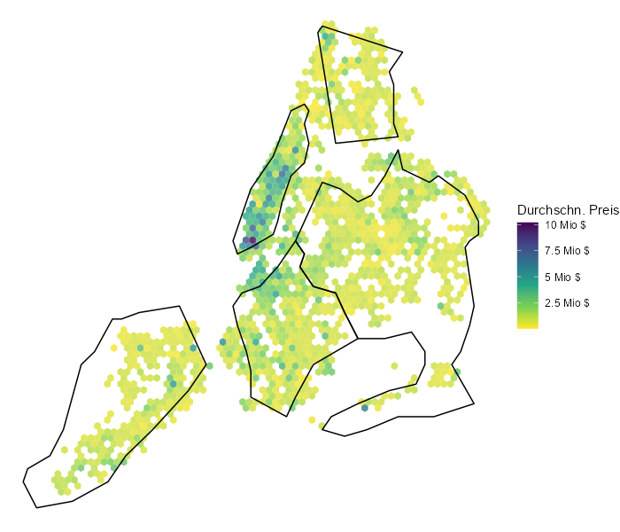

# Code Beispiel, Analyse des Kaggle Datensets: New York Housing Market

### Zusammenfassung:

Das Datenset wurde analysiert, bereinigt und ein kleines Modell gebaut. Die Zielvariabel war der Preis der Immobilien.

### Datenherkunft:

Wurde von Kaggle gelden, unter:

<https://www.kaggle.com/datasets/nelgiriyewithana/new-york-housing-market>

### Ersteller:

Fabian Patronic 21.01.24
